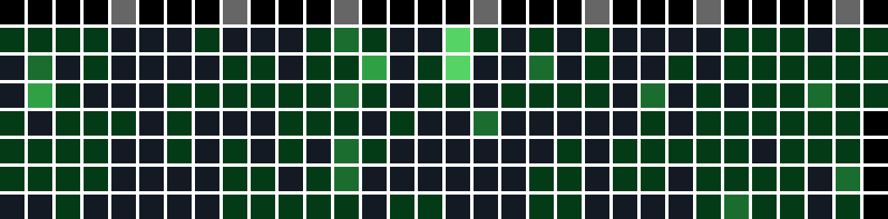
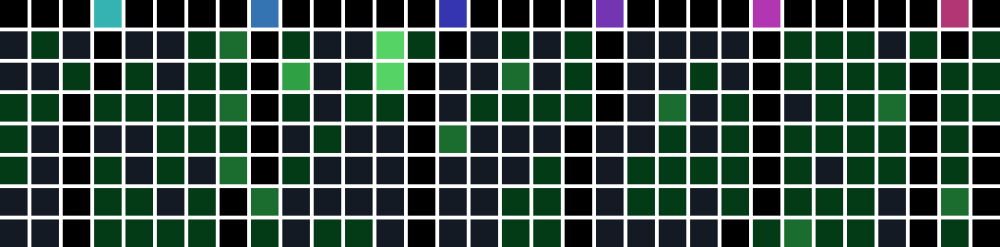
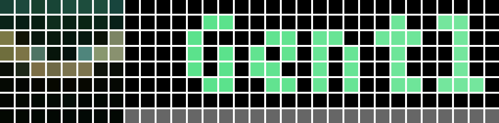
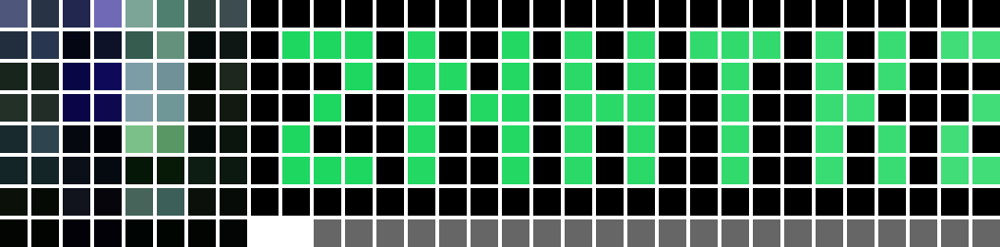

# App List

## github_followers

Shows the number of GitHub followers for a specified user.

|                          |                     -                     |
| :-------------------------------------------------------------------------------: | :---------------------------------------: |
|  | Use avatar as icon & auto unit conversion |

## github_contributions

Draws the GitHub contributions graph for a specified user.

|                                              |           -           |
| :-----------------------------------------------------------------------------------------------------------: | :-------------------: |
|                |    Split by month     |
|  | Rainbow month markers |

## spotify_current_playback

Shows the track you are currently playing on Spotify.

|                                          |                -                |
| :---------------------------------------------------------------------------------------------------------------: | :-----------------------------: |
|            |      Use album art as icon      |
|  | Use initials for CJK characters |

## bilibili_followers

Shows the number of Bilibili followers for a specified user.

|                                            |          -           |
| :-----------------------------------------------------------------------------------------------------: | :------------------: |
|  | Auto unit conversion |

## minecraft_server_status

Shows the status, online player count, max players of a Minecraft server.

|          |           -            |
| :-----------------------------------------------------------------------------: | :--------------------: |
|  | When server is offline |

## air_quality

(China mainland) Shows the AQI for a specified city.

|    | Green  |
| :-----------------------------------------------------------: | :----: |
|  | Yellow |
|  | Orange |

## gas_price

(China mainland) Shows the latest gas price for a specified province.

|  |         #92          |
| :-----------------------------------------------: | :------------------: |
|  | #0 / #89 / #95 / #98 |

## year_progress

Shows the progress (in percentage) of the current year.

|  |   -   |
| :-------------------------------------------------: | :---: |

## network_speed

Shows the current network upload and download speed.
(This is a shell script.)

|  | Download |
| :-------------------------------------------------------------------: | :------: |
|      |  Upload  |
